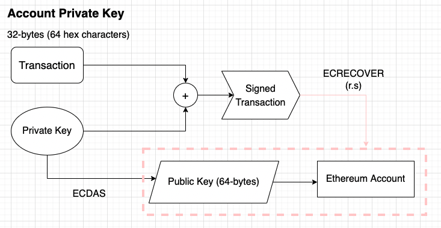

# Ethers.js by Example
Learn how to use ethers.js from these examples.

## Technology Stack & Tools

- Javascript (Writing scripts)
- [Ethers.js](https://docs.ethers.io/v5/) (Blockchain Interaction)
- [Node.js](https://nodejs.org/en/) (To run our scripts and install ethers.js)
- [Infura](https://infura.io/) (Node provider)
- [Chainlink Faucets](https://faucets.chain.link/rinkeby)

## Setting Up
### 1. Clone/Download the Repository

### 2. Install Dependencies:
```
$ npm install
```

### 3. Create a file data.json, and add your data into it
```
{
  "INFURA_ID": "infura id",
  "WALLET_ADDRESS": "your wallet address 1",
  "ADDRESS_PRIVATE_KEY": "your private key of address 1",
  "WALLET_ADDRESS_2": "your wallet address 2",
}
```


## Ethers.js scripts

### 1_accounts.js - Reads balance of ether of wallet address
- Input your infura project ID 
- Input your account1 public key
```
$ node examples/1_accounts.js
```

### 2_read_smart_contract.js - Reads the balance of Dai wallet address from the Dai contract
- Input your infura project ID
- Input your account1 public key
```
$ node examples/2_read_smart_contract.js
```

### 3_send_signed_transaction.js - Transfers 0.025 ether from account1 to account2
- Input your infura project ID 
- Input your account1 public key
- Input your account2 public key
- Input your account1 private key
```
$ node examples/3_send_signed_transaction.js
```
#### Transaction
[ecrecover](https://soliditydeveloper.com/ecrecover)


### 4_write_contract.js - Uses LINK contract on Rinkeby testnet
- Input your infura project ID 
- Input your account1 public key
- Input your account2 public key
- Input your account1 private key
- Input contract address of the token you want to transfer (You can use the deployed contract address from the previous script)
```
$ node examples/4_write_contract.js
```

### 5_contract_event_stream.js - Queries a block for transfer events
- Input your infura project ID 
```
$ node examples/5_contract_event_stream.js
```

### 6_inspecting_blocks.js - Get the block from the network, and get transactions from it.
- Input your infura project ID 
```
$ node examples/6_inspecting_blocks.js
```

### 7_inspecting_blocks.js - Get transactions from block
- Input your infura project ID 
```
$ node examples/7_inspecting_blocks.js
```